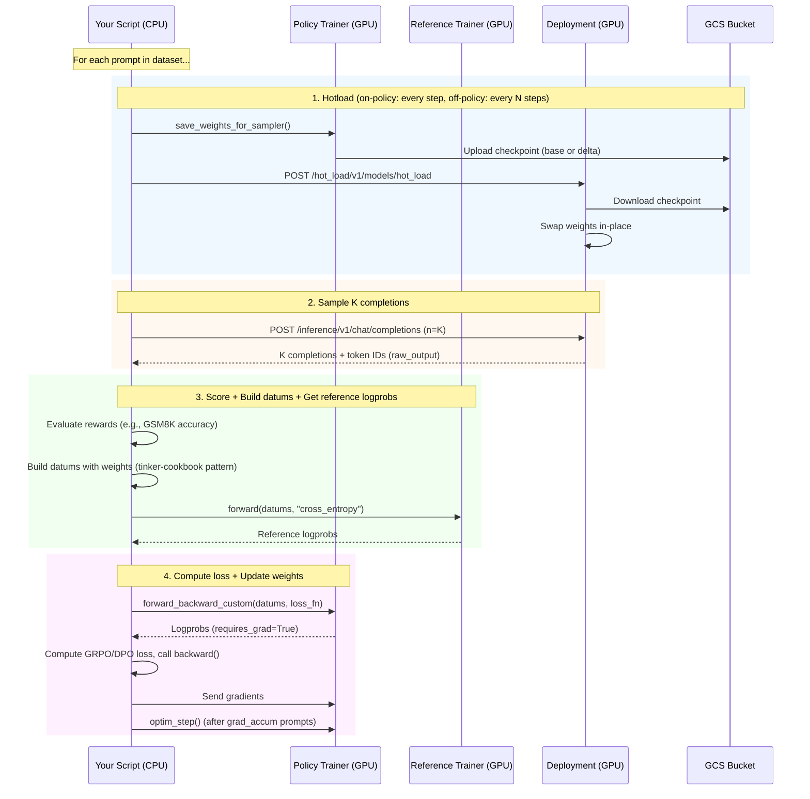

# Fireworks RL Training Examples

RL training scripts using the Tinker SDK with Fireworks infrastructure.

## Scripts

| Script | Algorithm | Hotload Frequency | Importance Sampling |
|--------|-----------|-------------------|---------------------|
| `train_grpo.py` | GRPO (on-policy) | Every optimizer step | No (ρ=1) |
| `train_grpo_off_policy.py` | GRPO (off-policy) | Every N steps | Yes (ρ = π_current / π_behavior) |
| `train_dpo.py` | DPO | End of training only | No |

Shared infrastructure code lives in `shared/`:

```
shared/
├── rlor.py         # Create, poll, delete RLOR trainer jobs
├── deployment.py   # Create, poll, delete hotload-enabled deployments
├── hotload.py      # Trigger hotload + wait for completion
├── dataset.py      # Load GSM8K dataset + evaluate responses
└── tokenizer.py    # Encode text via trainer's tokenizer endpoint
```

## How It Works

### Step 1: Create a Deployment

A deployment is an inference endpoint that serves your model for sampling completions.
With hotload enabled, you can update its weights during training without restarting.

→ See `shared/deployment.py`: `create_or_get_deployment()`, `wait_for_deployment_ready()`

### Step 2: Create RLOR Trainer Jobs

RLOR jobs are GPU-backed training servers managed by Fireworks. Each job loads the model
onto dedicated hardware and exposes a Tinker API for forward/forward_backward/optim_step calls.

- **Policy trainer**: Trainable. Linked to the deployment so it can upload checkpoints for hotloading.
- **Reference trainer** (GRPO only): Frozen copy of the initial model. Used for KL regularization.
  DPO doesn't need this — it caches reference logprobs at initialization.

→ See `shared/rlor.py`: `create_rlor_service_job_and_wait()`

### Step 3: Connect Tinker SDK Clients

After RLOR jobs are running, create Tinker SDK clients to talk to them:

```python
service = tinker.ServiceClient(base_url=trainer_endpoint.base_url)
training_client = service.create_lora_training_client(base_model=model, rank=lora_rank)
```

These clients provide `forward()`, `forward_backward_custom()`, `optim_step()`, and
`save_weights_for_sampler()`.

### Step 4: Training Loop

The following diagram shows the data flow during each training iteration:



→ See `shared/hotload.py`: `hotload_load_model()`, `wait_for_hotload_ready()`

### Step 5: Save Final Checkpoint + Hotload

After training completes, save the final weights and hotload them so the deployment
serves the trained model.

### Step 6: Cleanup

Delete RLOR jobs and deployment to release GPU resources. The scripts register an
`atexit` handler that automatically cleans up on Ctrl+C or exceptions, so resources
are released even if the script is interrupted.

Use `--cleanup-rlor-job --cleanup-deployment` to enable automatic cleanup.

→ See `shared/rlor.py`: `delete_rlor_job()`, `shared/deployment.py`: `delete_deployment()`

## Install & Run

```bash
pip install fireworks-ai[rl]

export FIREWORKS_API_KEY="..."
export FIREWORKS_ACCOUNT_ID="..."
```

### GRPO On-Policy

```bash
python examples/training/train_grpo.py \
    --base-model "accounts/fireworks/models/qwen3-8b" \
    --dataset /path/to/gsm8k.jsonl \
    --lora-rank 0 \
    --max-seq-len 4096 \
    --max-new-tokens 1024 \
    --epochs 1 \
    --max-rows 200 \
    --group-size 8 \
    --temperature 1.0 \
    --kl-beta 0.001 \
    --lr 1e-5 \
    --grad-accum 4 \
    --create-deployment \
    --hotload-deployment-id "grpo-run" \
    --deployment-shape "accounts/{account}/deploymentShapes/{shape}" \
    --deployment-region "EU_ICELAND_2" \
    --skip-validations \
    --save-sampler \
    --hotload \
    --cleanup-rlor-job \
    --cleanup-deployment
```

### GRPO Off-Policy

Same as on-policy, with these additions:

```bash
    --hotload-interval 5    # Hotload every 5 steps instead of every step
    --clip-rho 10.0         # Clip importance ratio for stability
```

The off-policy version uses importance sampling (`ρ = π_current / π_behavior`) to correct
for the mismatch between the deployment's (stale) weights and the trainer's current weights
between hotloads.

### DPO

```bash
python examples/training/train_dpo.py \
    --base-model "accounts/fireworks/models/qwen3-8b" \
    --dataset /path/to/preference_data.jsonl \
    --lora-rank 0 \
    --max-seq-len 4096 \
    --epochs 1 \
    --max-pairs 200 \
    --beta 0.1 \
    --lr 1e-5 \
    --grad-accum 4 \
    --create-deployment \
    --hotload-deployment-id "dpo-run" \
    --deployment-shape "accounts/{account}/deploymentShapes/{shape}" \
    --deployment-region "EU_ICELAND_2" \
    --skip-validations \
    --save-sampler \
    --hotload \
    --cleanup-rlor-job \
    --cleanup-deployment
```

### Warm Starting from a Checkpoint

To resume training from a previously saved checkpoint, use the Tinker SDK's
`load_state` method after creating the training client:

```python
# Load weights from a previous checkpoint (fresh optimizer state)
training_client.load_state("/path/to/checkpoint").result()

# Or load with optimizer state for exact resume:
training_client.load_state_with_optimizer("/path/to/checkpoint").result()
```

## What We Use from Tinker SDK

| Component | Usage |
|-----------|-------|
| `ServiceClient` | Connect to RLOR trainer endpoints |
| `TrainingClient` | `forward_backward_custom()`, `optim_step()`, `forward()` |
| `save_weights_for_sampler()` | Save checkpoints (with `checkpoint_type` via `import fireworks.rl`) |
| `Datum`, `ModelInput`, `TensorData` | Data structures for training |
| `datum_from_tokens_weights()` | Datum construction with weights (from `tinker-cookbook`) |

### What We Extend

| Tinker Component | What We Add |
|------------------|-------------|
| `SamplingClient` | We use the Fireworks Chat Completions API with `raw_output=True` instead, for sampling from the deployment |
| Built-in loss functions | We use `forward_backward_custom()` with custom GRPO/DPO loss functions |
| `save_weights_for_sampler()` | We patch it (`import fireworks.rl`) to add `checkpoint_type` support for base/delta saves |
