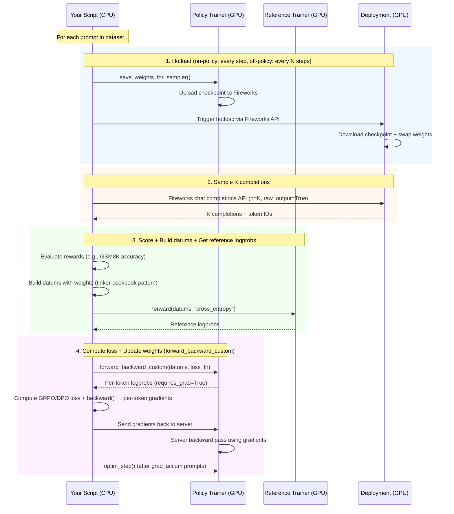

# Fireworks Training Examples

Training scripts (GRPO, DPO) using the Tinker SDK with Fireworks infrastructure.
For GRPO, we use both a trainable policy client and a frozen reference client for KL regularization.

## Scripts

| Script | Algorithm | Hotload Frequency | Importance Sampling |
|--------|-----------|-------------------|---------------------|
| `train_grpo.py` | GRPO (on-policy) | Every optimizer step | No (ρ=1) |
| `train_grpo_off_policy.py` | GRPO (off-policy) | Every N steps | Yes (ρ = π_current / π_behavior) |
| `train_dpo.py` | DPO | End of training only | No |
| `cleanup.py` | Utility | N/A | N/A |

Shared infrastructure code lives in `shared/`:

```
shared/
├── rlor.py         # Create, poll, delete RLOR trainer jobs
├── deployment.py   # Create, poll, delete hotload-enabled deployments
├── hotload.py      # Trigger hotload + wait for completion
├── dataset.py      # Load GSM8K dataset + evaluate responses
└── tokenizer.py    # Encode text via trainer's tokenizer endpoint
```

## On-policy vs Off-policy (quick scan)

| Dimension | On-policy (`train_grpo.py`) | Off-policy (`train_grpo_off_policy.py`) |
|-----------|------------------------------|------------------------------------------|
| Sampling policy freshness | Always current | Potentially stale between hotloads |
| Hotload cadence | Every optimizer step | Every `--hotload-interval` steps |
| Correction term | None (`ρ=1`) | Importance sampling ratio `ρ = π_current / π_behavior` |
| Key extra flags | None | `--hotload-interval`, `--clip-rho` |
| Compute overhead | Lower | Higher (prefill logprobs + ratio correction) |

## How It Works

### Step 1: Create a Deployment

A deployment is an inference endpoint that serves your model for sampling completions.
With hotload enabled, you can update its weights during training without restarting.

→ See `shared/deployment.py`: `create_or_get_deployment()`, `wait_for_deployment_ready()`

### Step 2: Create RLOR Trainer Jobs

RLOR jobs are GPU-backed training servers managed by Fireworks. Each job loads the model
onto dedicated hardware and exposes a Tinker API for forward/forward_backward/optim_step calls.

- **Policy trainer**: Trainable. Linked to the deployment so it can upload checkpoints for hotloading.
- **Reference trainer** (GRPO only): Frozen copy of the initial model. Used for KL regularization.
  DPO doesn't need this — it caches reference logprobs at initialization.

→ See `shared/rlor.py`: `create_rlor_service_job_and_wait()`

### Step 3: Connect Tinker SDK Clients

After RLOR jobs are running, create Tinker SDK clients to talk to them:

```python
service = tinker.ServiceClient(base_url=trainer_endpoint.base_url)
training_client = service.create_lora_training_client(base_model=model, rank=lora_rank)
```

These clients provide `forward()`, `forward_backward_custom()`, `optim_step()`, and
`save_weights_for_sampler()`.

### Step 4: Training Loop

The following diagram shows the data flow during each training iteration:



→ See `shared/hotload.py`: `hotload_load_model()`, `wait_for_hotload_ready()`

### Step 5: Save Final Checkpoint + Hotload

After training completes, save the final weights and hotload them so the deployment
serves the trained model.

### Step 6: Cleanup

Delete RLOR jobs and deployment to release GPU resources. The scripts register an
`atexit` handler that automatically cleans up on Ctrl+C or exceptions, so resources
are released even if the script is interrupted.

Use `--cleanup-rlor-job --cleanup-deployment` to enable automatic cleanup.

→ See `shared/rlor.py`: `delete_rlor_job()`, `shared/deployment.py`: `delete_deployment()`

If your process is terminated without running `atexit` (for example: `kill -9`, host restart,
remote shell disconnect before Python handles shutdown), use `cleanup.py` for manual cleanup.

Dry-run:

```bash
python examples/training/cleanup.py \
    --rlor-job-id "<policy_job_id>" \
    --rlor-job-id "<reference_job_id>" \
    --deployment-id "<deployment_id>"
```

Delete:

```bash
python examples/training/cleanup.py \
    --rlor-job-id "<policy_job_id>" \
    --rlor-job-id "<reference_job_id>" \
    --deployment-id "<deployment_id>" \
    --delete
```

## Client vs Server: What Runs Where

Understanding what runs on your machine vs on Fireworks GPUs:

| What | Where | How |
|------|-------|-----|
| Training loop orchestration | **Your machine** (CPU) | Python script |
| Sampling completions | **Fireworks Deployment** (GPU) | Fireworks chat completions API |
| Forward pass (logprobs) | **Fireworks Trainer** (GPU) | `training_client.forward()` via Tinker SDK |
| Backward pass (gradients) | **Fireworks Trainer** (GPU) | `forward_backward_custom()` via Tinker SDK |
| Loss computation | **Your machine** (CPU) | Custom PyTorch loss function |
| Optimizer step | **Fireworks Trainer** (GPU) | `training_client.optim_step()` via Tinker SDK |
| Checkpoint save | **Fireworks Trainer** (GPU) | `save_weights_for_sampler()` via Tinker SDK |
| Hotload trigger | **Your machine** → **Deployment** | Fireworks hotload REST API |
| Reward evaluation | **Your machine** (CPU) | Custom reward function (e.g., GSM8K accuracy) |

### How `forward_backward_custom` Works

This is the key mechanism that lets you define custom loss functions (GRPO, DPO) on your
CPU machine while the heavy GPU work happens on the Fireworks trainer:

```
1. Your script sends datums (token sequences) to the trainer
2. Trainer runs forward pass on GPU → computes per-token logprobs
3. Logprobs are sent back to your script as PyTorch tensors (requires_grad=True)
4. Your script computes the custom loss (e.g., GRPO advantage-weighted policy gradient)
5. Your script calls loss.backward() → PyTorch autograd computes ∂L/∂logprobs
6. These per-token gradients (∂L/∂logprobs) are sent back to the trainer
7. Trainer constructs a surrogate loss and runs backward on GPU to get ∂L/∂θ
```

**Why this is mathematically correct (the surrogate loss trick):**

The real loss `L` depends on model parameters `θ` only through the logprobs:

```
θ  →  logprobs  →  L(logprobs, rewards, ref_logprobs, ...)
```

By the chain rule: `∂L/∂θ = (∂L/∂logprobs) · (∂logprobs/∂θ)`

Your script computes `∂L/∂logprobs` (step 5) — this is just scalar math on CPU, no model
weights needed. The trainer needs to compute `∂logprobs/∂θ` — this requires the full model
on GPU. To combine them, the trainer constructs a **surrogate loss**:

```
surrogate_loss = dot(logprobs, ∂L/∂logprobs.detach())
```

When the trainer calls `surrogate_loss.backward()`, PyTorch autograd computes:

```
∂(surrogate_loss)/∂θ = (∂L/∂logprobs) · (∂logprobs/∂θ) = ∂L/∂θ  ✓
```

This gives exactly the correct gradient `∂L/∂θ`, because `∂L/∂logprobs` is treated as a
constant (detached) and `logprobs` carries the computation graph back to `θ`. The result is
identical to computing `L` directly on GPU and calling `L.backward()` — but the loss function
itself runs entirely on your CPU.

This split lets you write arbitrary loss functions in Python without needing GPU access.
The trainer handles all the distributed GPU work (FSDP, PP, EP) transparently.

## Install & Run

```bash
pip install fireworks-ai[training]

export FIREWORKS_API_KEY="..."
export FIREWORKS_ACCOUNT_ID="..."
```

### GRPO On-Policy

```bash
python examples/training/train_grpo.py \
    --base-model "accounts/fireworks/models/qwen3-8b" \
    --dataset /path/to/gsm8k.jsonl \
    --lora-rank 0 \
    --max-seq-len 8192 \
    --max-new-tokens 8192 \
    --epochs 1 \
    --max-rows 200 \
    --group-size 8 \
    --temperature 1.0 \
    --kl-beta 0.001 \
    --lr 1e-5 \
    --grad-accum 4 \
    --create-deployment \
    --hotload-deployment-id "grpo-run" \
    --deployment-shape "accounts/{account}/deploymentShapes/{shape}" \
    --deployment-region "EU_ICELAND_2" \
    --skip-validations \
    --save-sampler \
    --hotload \
    --cleanup-rlor-job \
    --cleanup-deployment
```

### GRPO Off-Policy

Same as on-policy, with these additions:

```bash
    --hotload-interval 5    # Hotload every 5 steps instead of every step
    --clip-rho 10.0         # Clip importance ratio for stability
```

The off-policy version uses importance sampling (`ρ = π_current / π_behavior`) to correct
for the mismatch between the deployment's (stale) weights and the trainer's current weights
between hotloads.

### DPO

```bash
python examples/training/train_dpo.py \
    --base-model "accounts/fireworks/models/qwen3-8b" \
    --dataset /path/to/preference_data.jsonl \
    --lora-rank 0 \
    --max-seq-len 4096 \
    --epochs 1 \
    --max-pairs 200 \
    --beta 0.1 \
    --lr 1e-5 \
    --grad-accum 4 \
    --create-deployment \
    --hotload-deployment-id "dpo-run" \
    --deployment-shape "accounts/{account}/deploymentShapes/{shape}" \
    --deployment-region "EU_ICELAND_2" \
    --skip-validations \
    --save-sampler \
    --hotload \
    --cleanup-rlor-job \
    --cleanup-deployment
```

## What We Use from Tinker SDK

| Component | Usage |
|-----------|-------|
| `ServiceClient` | Connect to RLOR trainer endpoints |
| `TrainingClient` | `forward_backward_custom()`, `optim_step()`, `forward()` |
| `save_weights_for_sampler()` | Save checkpoints (with `checkpoint_type` via `import fireworks.training`) |
| `Datum`, `ModelInput`, `TensorData` | Data structures for training |
| `datum_from_tokens_weights()` | Datum construction with weights (from `tinker-cookbook`) |

### What We Extend / Replace

| Tinker Component | What We Do Differently | Why |
|------------------|----------------------|-----|
| `SamplingClient` | Use Fireworks Chat Completions API (`raw_output=True`) | Sample from a hotload-enabled deployment, not the trainer |
| Built-in loss functions (`importance_sampling`, `ppo`) | Use `forward_backward_custom()` with custom loss | Full control over GRPO/DPO loss computation on client side |
| `save_weights_for_sampler()` | Patch via `import fireworks.training` to add `checkpoint_type` | Enables base/delta checkpoint saves for efficient hotloading |
| Checkpoint loading onto deployment | Use Fireworks hotload REST API | Push trained weights to a live inference deployment |
| Deployment management | Use Fireworks SDK (`client.deployments.create()`) | Create/manage hotload-enabled inference endpoints |
| Trainer job management | Use Fireworks SDK (`client.reinforcement_fine_tuning_steps.create()`) | Create/manage GPU trainer instances |
